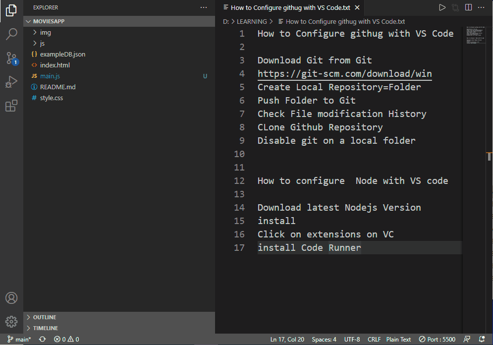

> **Note:** We've made significant changes to this
> repo to make it easier to use and maintain.
> If you've already cloned this repo, please do it again.
> The most significant differences include:
> * If you want to build the site,
>   a Docker container now makes build setup simpler.
>   For example, you no longer need to install nvm.
> * The default branch is now called `main`
>   (it was previously `master`).
> * Some files — in particular, image files —
>   have been moved.
> 
> Stay tuned for another significant update to
> the website repo later this year.
> 
> Thanks, as always, for your continued support!

## Table of contents
* [Issues, bugs, and requests](#issues-bugs-and-requests)
* [Before you submit a PR](#before-you-submit-a-pr)
* [Before you build this site](#before-you-build-this-site)
  - [1. Get the prerequisites](#1-get-the-prerequisites)
  - [2. Clone this repo _and_ its submodules](#2-clone-this-repo-and-its-submodules)
* [Setting up your local environment and serving changes](#setting-up-your-local-environment-and-serving-changes)
* [Creating and/or editing DartPad example code](#creating-andor-editing-dartpad-example-code)
  - [DartPad example code in GitHub gists](#dartpad-example-code-in-github-gists)
  - [DartPad example code in this repo](#dartpad-example-code-in-this-repo)
* [Deploying to a staging site](#deploying-to-a-staging-site)
* [Writing for flutter.dev](#writing-for-flutterdev)


## Issues, bugs, and requests

We welcome contributions and feedback on our website. 
Please file a request in our
[issue tracker](https://github.com/flutter/website/issues/new/choose) 
or create a [pull request](https://github.com/flutter/website/pulls). 
For simple changes (such as tweaking some text), 
it's easiest to make changes using the GitHub UI.

If you have an issue with the 
API docs on [api.flutter.dev](https://api.flutter.dev), 
please file those issues on 
the [flutter/flutter](https://github.com/flutter/flutter/issues) repo, 
not on this (flutter/website) repo. 
The API docs are embedded in Flutter's source code, 
so the engineering team handles those.


## Before you submit a PR

We love it when the community gets involved in improving our docs! 
But here are a few notes to keep in mind before you submit a PR:

- When triaging issues, 
  we sometimes label an issue with the tag **PRs welcome**. 
  But we welcome PRs on other issues as well&mdash;
  it doesn't have to be tagged with that label.
- Please don't run our docs through Grammarly (or similar) 
  and submit those changes as a PR.
- We follow the [Google Developer Documentation Style Guidelines][] —
  for example, don't use "i.e." or "e.g.", 
  and avoid writing in first person. 
  You can start with the
  [style guide highlights](https://developers.google.com/style/highlights) 
  or the [word list](https://developers.google.com/style/word-list), 
  or use the search bar that's at the top of every style guide page. 

> We truly thank you for your willingness and helpfulness
> in keeping the website docs up to date!


## Before you build this site

For changes beyond simple text and CSS tweaks, 
we recommend building the site.

### 1. Get the prerequisites
Install the following tools, if you don't have them already:

- **bash**, the Bourne shell. 
  These instructions assume you're using `bash`, 
  and setup might not work if you use another shell.
- **GNU Make**. 
  On Windows the easiest way to install Make is `choco install make`. 
  Other options include using a [subsystem](https://docs.microsoft.com/en-us/windows/wsl/install-win10). 
- **Docker**. 
  We use Docker for local dev, tests, and building the site. 
  Install it from https://docs.docker.com/get-docker/.
- **Firebase CLI**, for hosting the site locally. 
  One way to get this is to run `npm install -g firebase-tools`. 
  For full setup details, 
  read the [Firebase CLI documentation](https://firebase.google.com/docs/cli).

### 2. Clone this repo _and_ its submodules

> **Note:** This repo has git _submodules_, 
> which affects how you clone it. 
> The GitHub documentation has general help on [forking][] and [cloning][] repos.

If you're outside of the Flutter organization, 
we recommend you **create a fork** of the repo under your own account, 
and then submit a PR from that fork. 

Once you have a fork (or you're a Flutter org member), 
_choose one_ of the following submodule-cloning techniques:

- Clone the repo and its submodule at the same
  using the `--recurse-submodules` option:
  ```bash
  $ git clone --recurse-submodules https://github.com/<username-or-flutter>/website.git
  ```
